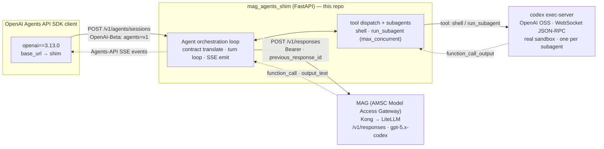

# Architecture

A visual, self-contained version is in [`architecture.html`](architecture.html)
(open in any browser — no dependencies).

## Data flow

## The core loop

1. Client sends an Agents API request (`POST /v1/agents/sessions`, header
   `OpenAI-Beta: agents=v1`) to the shim.
2. The shim translates it into a MAG `POST /v1/responses` call (Bearer auth).
3. MAG returns either streamed text or a `function_call` item.
4. On `function_call`, the shim executes the tool — `shell` runs in the real
   `codex exec-server` sandbox; `run_subagent` spawns a bounded, concurrent
   sub-loop, each with its own sandbox.
5. The shim appends the `function_call_output` and re-calls `/v1/responses` with
   `previous_response_id` (stateful chaining) until the model emits a final answer.
6. Throughout, the shim emits SDK-faithful Agents-API SSE events back to the client.

## Why it's a thin adapter

MAG already exposes every primitive the Agents API is built on (`/v1/responses`,
model-emitted `function_call`, stateful sessions via `previous_response_id`,
streaming SSE, `/responses/compact`). The adapter only owns the Agents API
HTTP/SSE contract, the tool-execution loop, and the sandbox wiring — not a harness
rewrite. See the top-level [README](../README.md) for the verified-primitives table
and the fidelity matrix.

## Modules

| File | Responsibility |
|---|---|
| `mag_agents_shim.py` | FastAPI service: routes, agent loop, tool dispatch, stream + non-stream |
| `agents_api_models.py` | SDK-faithful builders for session objects + streaming events |
| `codex_sandbox.py` | Client for OpenAI's OSS `codex exec-server` (real sandbox) |
| `validate_models.py` | Offline check that builders parse against `openai==3.13.0` models |
